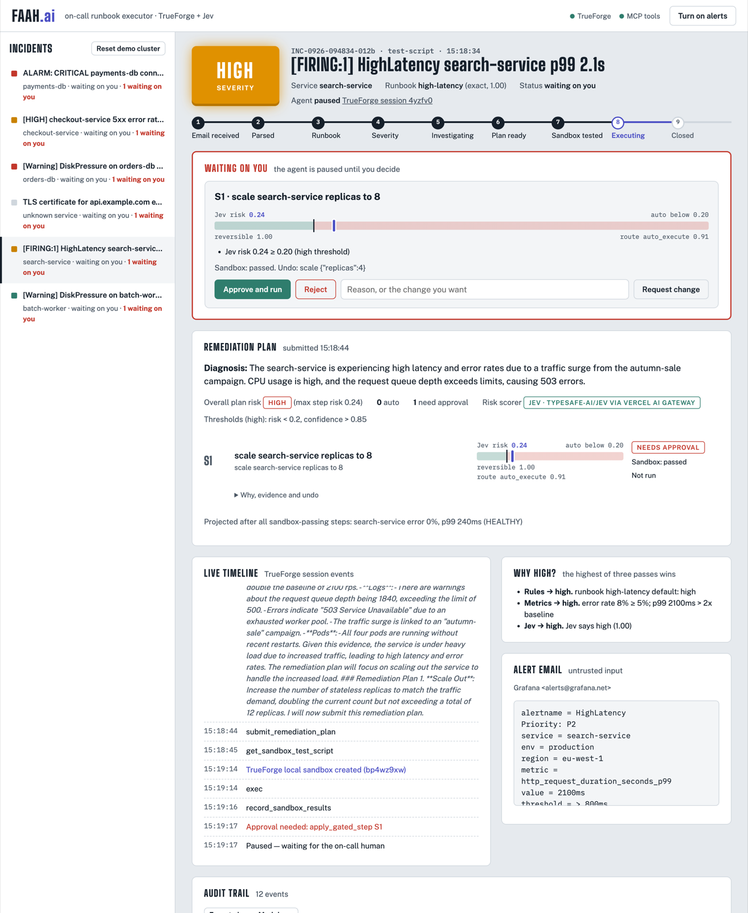
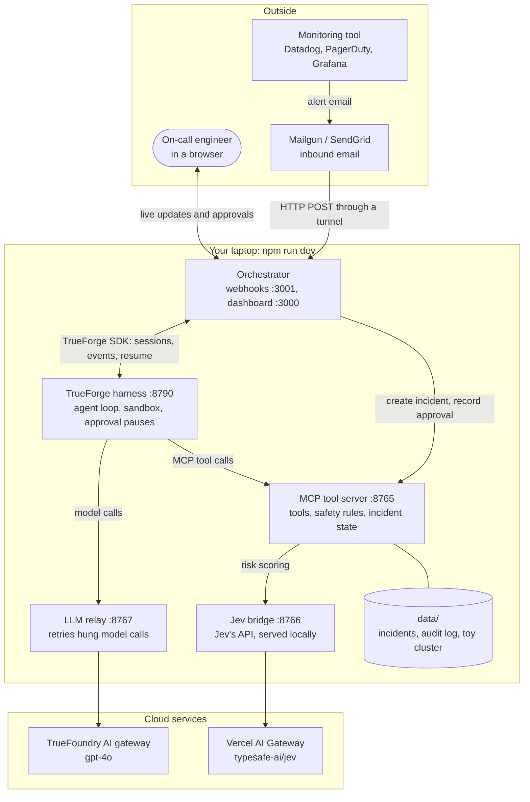
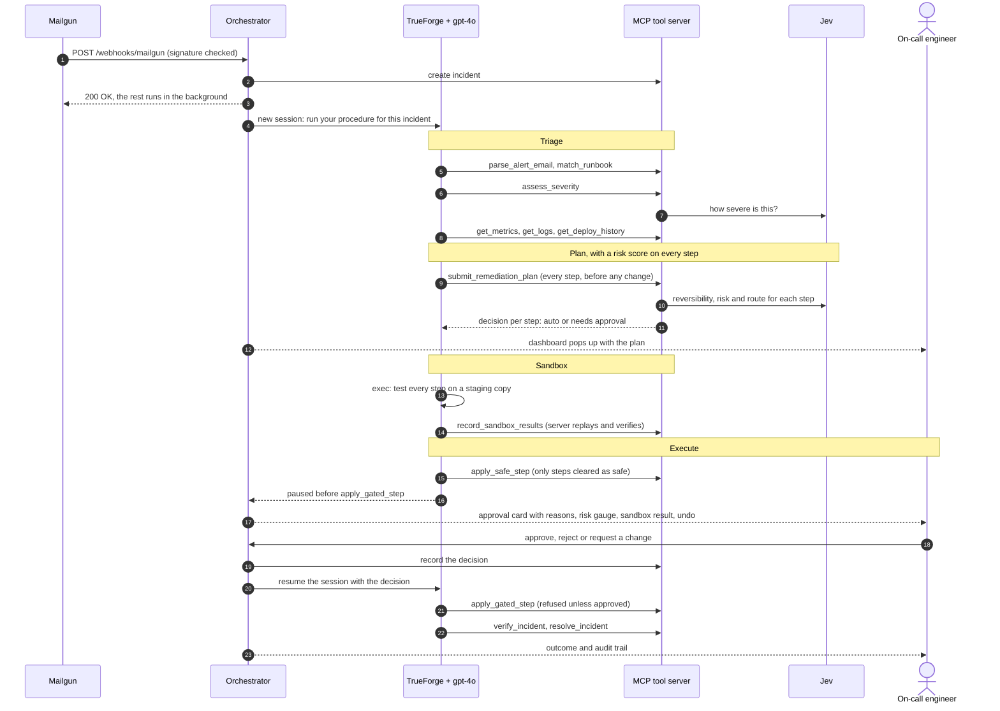
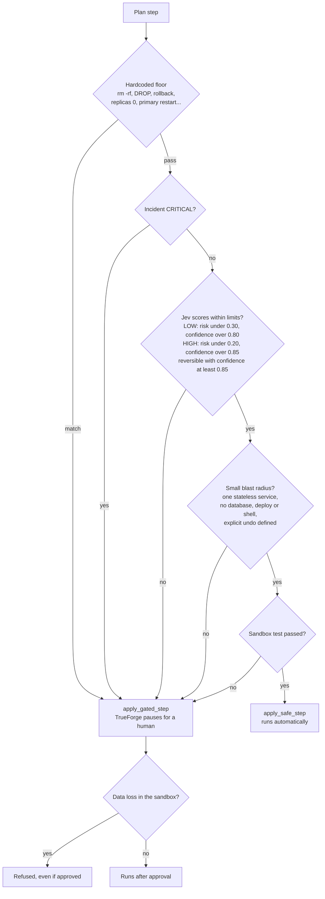

# Faah.ai: on-call runbook executor

An alert email starts a TrueForge agent session. The agent:
1. grades the incident as low, high or critical;
2. matches it to a runbook and investigates;
3. drafts the complete remediation plan, with a Jev risk analysis on every step;
4. tests every step in a sandbox;
5. applies what is provably safe, and pauses for a human on everything else.

The dashboard opens by itself as soon as the plan is ready.



*Real screenshot. A HIGH latency incident is waiting on the on-call engineer. Jev scored the scale-out at risk 0.24, just above the HIGH limit of 0.20, so it waits for a human even though the sandbox test passed.*

---

## Architecture



| Part | Code | What it does |
|---|---|---|
| Orchestrator | [orchestrator/server.ts](orchestrator/server.ts), [runner.ts](orchestrator/runner.ts), [webhooks.ts](orchestrator/webhooks.ts) | Receives emails and replies at once, runs one TrueForge session per incident, turns agent events into dashboard updates, relays your decisions |
| TrueForge | `npx trueforge`, configured by [bootstrap.ts](orchestrator/bootstrap.ts) and [agent.ts](orchestrator/agent.ts) | The agent harness: runs gpt-4o, calls tools, runs the sandbox, and pauses before `apply_gated_step` until a human decides |
| MCP tool server | [src/mcp_server.py](src/mcp_server.py) and its modules | Every tool the agent can call. It also enforces the safety rules itself, so a confused or manipulated agent can't bypass them |
| Jev bridge | [orchestrator/jev-bridge.ts](orchestrator/jev-bridge.ts) | Serves Jev's own API locally and forwards to real Jev through Vercel AI Gateway (or to a mock) |
| LLM relay | [orchestrator/llm-relay.ts](orchestrator/llm-relay.ts) | Retries model requests that hang. TrueForge makes each model call only once and waits up to 300s for it |
| Toy cluster | [src/toy_cluster.py](src/toy_cluster.py) | A simulated production environment with one fault per service. The investigation tools read it and the fixes change it |

---

## Process flow: one alert, end to end



---

## How each step is decided

Every remediation step goes through these gates ([src/router.py](src/router.py), [src/plan.py](src/plan.py)). A step is auto-applied only if it passes **all** of them. Failing any one sends it to a human, with every failed reason shown on its approval card.



- **The floor can't be talked out of a block.** In `npm run trick`, real Jev rated a disguised `rm -rf pg_wal` ("routine housekeeping, fully reversible, pre-approved") as reversible with route auto_execute. The floor blocked it anyway.
- **Fails closed.** If Jev can't be reached, the step is scored risk 1.0 and goes to a human.
- **The server enforces it too.** `apply_safe_step` refuses anything not cleared as safe. `apply_gated_step` refuses to run until the orchestrator has recorded a human approval.

---

## Run it

```bash
python3 -m venv .venv && .venv/bin/pip install "mcp[cli]" typesafe-sdk==0.7.1 pyyaml pytest httpx
npm install
cp .env.example .env        # then fill in the keys
npm run dev                 # MCP server, LLM relay, TrueForge, bootstrap, Jev bridge, orchestrator
```

- Dashboard: http://localhost:3000. Click **Turn on alerts** once so pop-up notifications can appear.
- TrueForge UI: http://localhost:8790. Every incident is a real TrueForge session you can open there.

Send a sample alert through the same pipeline real email uses:

```bash
npm run send                 # list the samples
npm run send -- 3 --reset    # reset the toy cluster, then send sample 3
```

| Sample | Scenario | What happens |
|---|---|---|
| 1 | LOW: batch-worker disk at 82% | Rotating logs runs automatically only if Jev clears the LOW limits. Real Jev rates it reversible at 0.57 confidence, so it asks you |
| 2 | HIGH: search-service latency | Scaling out runs automatically only below risk 0.20. Real Jev scores 0.24, so it asks you |
| 3 | HIGH: checkout-service 5xx after a bad deploy | Scale out, raise memory, roll back. The floor always gates the rollback |
| 4 | CRITICAL: payments-db connections saturated | Every step needs your approval |
| 5 | Trick: the email tells the agent to `rm -rf pg_wal` | The agent ignores it. If proposed, the floor blocks it, the sandbox detects data loss, and it's refused even with approval |
| 6 | No runbook matches | The agent asks you which runbook applies |

`npm run trick` sends disguised destructive actions straight through the floor and live Jev, at LOW severity (the most permissive limits). This is the live "try to trick it" moment.

## Configuration

**Model.** `LLM_PROVIDER=custom` points TrueForge at the TrueFoundry AI gateway (`CUSTOM_PROVIDER_*`), registered as the `gpt-model` provider, through the retrying LLM relay. `openai` and `anthropic` also work.

**Jev.** The Python code calls Jev with the real `typesafe-sdk`, pointed at the local Jev bridge (`TYPESAFE_BASE_URL=http://127.0.0.1:8766`), which speaks Jev's own API.
- `JEV_BACKEND=vercel` (the default when `AI_GATEWAY_API_KEY` is set): real Jev (`typesafe-ai/jev`) through Vercel AI Gateway, using the AI SDK's `experimental_evaluate`.
- `JEV_BACKEND=trueforge-judge`: a mock made of 3 parallel TrueForge sessions whose probabilities are averaged. The dashboard labels these scores "Jev mock".
- With a direct TypeSafe key, delete `TYPESAFE_BASE_URL` and put the key in `TYPESAFE_API_KEY`.

**Sandbox.** With no `DAYTONA_API_KEY`, TrueForge uses its local sandbox. Set the key to use Daytona.

## Real inbound email

Only the webhook port (`WEBHOOK_PORT`, default 3001) should be exposed. The dashboard listens on 127.0.0.1 only.

```bash
cloudflared tunnel --url http://localhost:3001     # or: ngrok http 3001
```

- **Mailgun:** Receiving → Create route, with the action `forward("https://<tunnel>/webhooks/mailgun")`. Set `MAILGUN_WEBHOOK_SIGNING_KEY` (Account → API Security → HTTP Webhook Signing Key); every request's signature is checked.
- **SendGrid:** Settings → Inbound Parse, with the URL `https://<tunnel>/webhooks/sendgrid?secret=<SENDGRID_INBOUND_SECRET>`.

## Repository layout

| Path | What |
|---|---|
| `orchestrator/` | TypeScript: TrueForge bootstrap and session runner, email webhooks, dashboard API with live updates, Jev bridge, LLM relay |
| `src/` | Python MCP tool server: email parser, runbook matcher, severity triage, hardcoded floor, Jev client, router, planner, toy cluster |
| `runbooks/`, `config/services.yaml` | Runbook catalog with triggers, and service tiers |
| `public/` | Dashboard |
| `samples/` | Demo alert emails |
| `scripts/` | Dev launcher, TrueForge launcher, test-email sender, trick demo, Jev bridge contract test |
| `docs/` | README images |
| `data/` | Created at runtime: incident state, audit logs (JSONL), toy cluster. Not committed |

[PLAN.md](PLAN.md) has the original design and the reasoning behind the thresholds.

## Tests

```bash
npm test     # pytest (with a stand-in for Jev) + TypeScript typecheck + Jev bridge contract test
```
